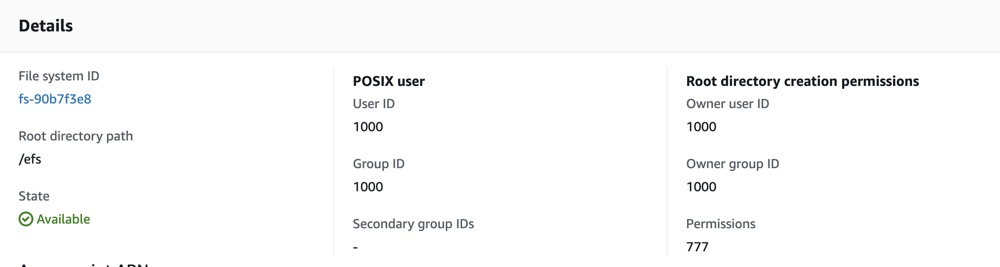
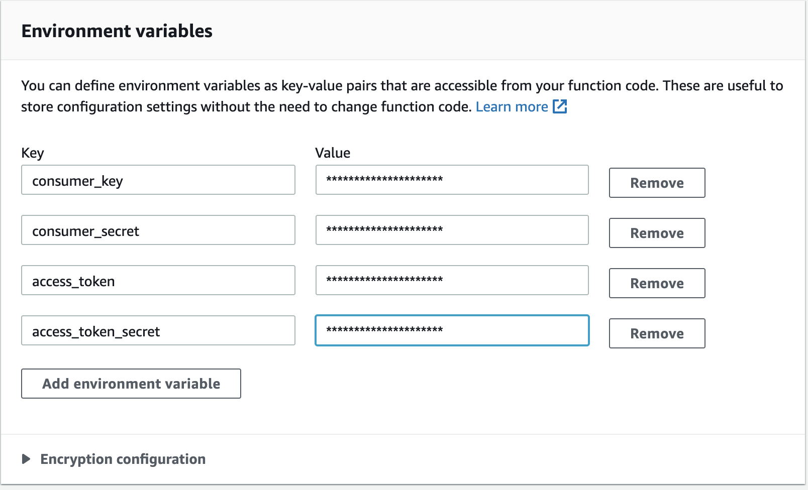

A while ago I trained a neural network to write poetry. It was a fun project with results that sometimes miss the mark and sometimes writes some interesting poetry.

I had been hosting it on an AWS EC2 server but with my 12 month free tier running out I moved it over to Lambda. There were some roadblocks along the way that I think would be worth sharing.

At the point it would have been nice to convert my model to [Tensorflow lite](https://www.tensorflow.org/lite) which is meant for execution of ML models on edge devices. The library is much smaller and could meet Lambda's 250MB maximum deployment package size. But unfortunately, there currently isn't support for the recurrent GRU unit used in my model. The next section discusses the workaround to load the Tensorflow library using Amazon's Elastic File System (EFS).

I'll go over:

- How to create a Lambda function
- How to load the large Tensorflow library into Lambda
- How to tweet from a Lambda function

First you need an AWS account.

In this post we'll create a Lambda function that loads Tensorflow and sends out a tweet with the results.

## Loading the Tensorflow library

The Tensorflow library is somewhere in the ballpark of 750MB far above Lambda's maximum. Luckily, we are able to load packages via the EFS service.

#### First create the EFS

From the Management Console search for EFS. Once at the service click on "Create file system". The following screen should pop up. Name it something memorable and choose you Virtual Private Cloud (VPC). I just used the default.


### Create an Access Point

From your new file system click the **Access points** tab and then click **Create access point**.  

Give it a name and root directory. Enter the following details and a tag.




### Loading Tensorflow into EFS

Now that we have a file system we have to load Tensorflow into it. It is easiest to do so through an EC2 instance. I chose to use the t2.medium instance. It isn't free-tier eligible but it is cheap and you don't need to have it running for long. It ended up costing me 0.14$CAD.

We won't go through the details of how to do this. If you like you can see these excellent Youtube Tutorials from Srce Cde:

- [How to use EFS (Elastic File System) with AWS Lambda](https://www.youtube.com/watch?v=4cquiuAQBco&ab_channel=SrceCde)
- [How to mount EFS on EC2 instance](https://www.youtube.com/watch?v=PHVthx8lG4g&ab_channel=SrceCde)
- [How to install library on EFS & import in lambda](https://www.youtube.com/watch?v=FA153BGOV_A&ab_channel=SrceCde)

A few things to note:

- Make sure you choose an Ubuntu instance when starting your EC2 server.
- When it comes to mounting EFS on your EC2 instance I would recommend setting the instance to automatically mount your file system. This saves the hassle of doing it manually
  - Choose your Machine Image (Ubuntu Server) and Instance Type (I chose t2.medium)
  - From "Configure Instance Details" scroll down to File Systems
  - Click "Add file system" and choose your EFS
  - Now your EFS will automatically mount in the "/mnt/efs/fs1" directory


Once the libraries you want are in EFS we can move onto creating our Lambda function.

## Creating a Lambda Function

From the AWS Management Console search Lambda and then click "Create Function".

We'll choose "Author from scratch" and choose Python 3.8 as our runtime. Then we'll create our function.


Now we have to connect our Lambda function to the same VPC as our EFS system. First we need to add some permissions. In the **Permissions** tab of your function click the role name. Then click the policy name. You're screen should look like this.


Click **Edit Policy** and add the following JSON lines in the Statement.

```json
{
      "Effect": "Allow",
      "Action": [
        "ec2:DescribeNetworkInterfaces",
        "ec2:CreateNetworkInterface",
        "ec2:DeleteNetworkInterface",
        "ec2:DescribeInstances",
        "ec2:AttachNetworkInterface"
      ],
      "Resource": "*"
    }
```


**Review policy** and **Save changes** and you can close the tab.

Now back on your Lambda function's page scroll down to the VPC tab. Click **Edit** and choose the same VPC as you have your EFS file system on. Choose all the subnets and your security group.


Notice that connecting to a VPC prevents you from directly accessing the Internet from your function. We'll work around this later.

Now we'll add our EFS. From your function click the **File system** tab and add a file system. Choose the file system and access point you just set up. Finally, give it a root path.


### Testing it out

By default Lambda times out after 3s. So in the **Basic settings** change the timeout time to something like 2mins and give it some more memory as well. 512MB will be plenty.

Now replace the pre-populated code with the following

```python
try: # Mount EFS
    import sys
    import os
    sys.path.append('/mnt/efs/')
except ImportError:
    print('Error')     

import json
import tensorflow as tf

def lambda_handler(event, context):      
    return {'tweet':tf.__version__ }   
```


This code mounts the EFS, loads Tensorflow and calls the package. If everything works you will see the following output.


Ok, we are nearly there. So far we have

- Stored Tensorflow in EFS
- Created a Lambda function
- Mounted our EFS system in Lambda
- Successfully loaded and used the Tensorflow library in our Lambda function


## Tweeting from Lambda

In order to mount EFS we have to put our function inside of a VPC. Unfortunately, the VPC makes it so we can't directly access the internet from our function. If we want to do something like make a tweet this is a problem.

AWS recommends using a NAT gateway in order to get around this problem. For industry applications this probably is best. However, for simpler applications where the Lambda function won't be called too often I think it is simpler just to invoke our function with another function outside of the VPC.

The drawback of this is of course that we are paying for 2 Lambda functions at once. However, AWS offers free-tier use of Lambda up to 1M requests and 400,000GBs per month. For a simple bot this is plenty and invoking 2 functions at once isn't much of a worry. Plus we skip all the hassle of configuring the NAT gateway.  

### Tweepy

In order to tweet from the [Twitter API](https://developer.twitter.com/en/docs) you have to make a [Twitter developer account](https://developer.twitter.com/en/apply-for-access). Once you have that you'll also be given

- Consumer key
- Consumer secret key
- Access token
- Access secret token

You'll need these in order to tweet from your account.

Tweepy is Twitter's python API. We'll also need this library in order to tweet. This time we can't use EFS, but luckily Lambda has the ability to add layers. We'll create a layer that holds Tweepy.

You'll have to install Tweepy and save it to

```python
python/lib/python3.*/site-packages/
```

this is the path that AWS expects python packages to be kept in.

Once you have your package installed you'll have to compress it as a .zip. Then go the the Lambda console and select **Layers**. Select **Create layer** and upload your compressed file. I installed a python3.7 version of Tweepy so I chose that as my runtime. You'll have to chose yours.


Hit create and now we have a Tweepy layer.

Create a new Lambda function now. This will be our driver function. Choose the appropriate python runtime. Once you have created your new function select the **Layers** tab and add the Tweepy layer you just created. Now the function should be able to successfully

```python
import tweepy
```

In order to use Tweepy we'll need the keys and secrets we got from Twitter. We'll set those as environment variables to keep them out of the code. From your driver function go to the **Environment variables** tab and enter your keys and secrets.





And that's it! We've now done the following

- Put Tensorflow in a EFS system
- Mounted the EFS system to a worker Lambda function
- Created a driver Lambda function outside of our VPC
- Set up a Lambda Layer that holds our Tweepy package

All that's left to do now is to test it. The following code invokes our worker function using boto3 and tweets its output.

```python
import json
import boto3
import tweepy
import ast
import os
from keys import keys

def tweet_string(tweet):
        auth = tweepy.OAuthHandler(os.environ['consumer_key'], os.environ['consumer_secret'])
        auth.set_access_token(os.environ['access_token'], os.environ['access_token_secret'])
        api = tweepy.API(auth, wait_on_rate_limit= True, wait_on_rate_limit_notify= True)
        api.update_status(status = tweet)


def callbot(event, context):

    # # Connect to worker  
    client = boto3.client('lambda')
    response = client.invoke(FunctionName='YOUR_WORKER_FUNCTION_NAME')

    # Read tweet
    dict_resp = response['Payload'].read().decode('UTF-8')
    mydata = ast.literal_eval(dict_resp)
    tweet = mydata['tweet']
    tweet_string(tweet)

    # Log tweet
    return {
        'statusCode': 200,
        'body': json.dumps('Tweeted \n: {}'.format(tweet))
    }
```


You can use [AWS EventBridge](https://aws.amazon.com/eventbridge/) in order to tweet using cron or in response to other events. If you are interested in seeing my bot in action check it out at [@poetrybot5](https://twitter.com/poetrybot5) on Twitter.
